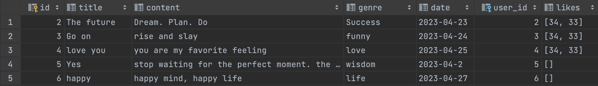

# Unit 04 Project


# Criteria A: Planning

## Problem Defenition

**Context**: The client, from an international high school in Japan, are having an interest in the "Quotes". The client sometimes feels depressed and tends to look at the quotes that give the client motivation for the client's life. A little while after the client started doing that sort of thing, the client started thinking that where these quotes came from, and who made these quotes. Since these quotes give the client motivation and energy a lot, the client wants to know who motivated the client every day. Moreover, the client started thinking that client also wants to make the quotes, be seen by everyone, and motivate everyone, because quotes helped the client a lot in the client's life. And the client wants to appreciate the people who are creating quotes by giving a like button, and the client wants to quickly find the quotes that the client wants to read at any given moment. And the client wants to organize the client's own quotes on one page to look at the reaction towards the client's quotes from other users.

**Problem**: The client doesn't know who made the quotes that the client was motivated by, and the client wants everyone to see the client's quotes.

## Proposed Solution

Looking at the situation of the client and what he/she wants, the social network service using Python, HTML, and CSS would be the best option for him/her to solve his/her problem.

### Design Statement

I will design a social media platform on a website built with Flask, Bootstrap, HTML, and CSS which stores data in an SQLite database for me and my classmates. This website will allow the users to post their quotes, with a like/dislike system to moderate the content. It will take approximately 1 month to complete and will be evaluated according to the criteria below:

### Success Criteria

1. [issue tackled: *"The client started thinking that client also wants to make the quotes, be seen by everyone"*] The website allows users to make their own accounts on the social platform with a registration system and login system.
2. [issue tackled: *"The client started thinking that where these quotes came from, and who made them"*] The website allows users to look at the quotes other users made.
3. [issue tackled: *"The client wants to quickly find the quotes that the client wants to read at any given moment"*]The website allows users to use the search function to find the quotes the user wants to read.
4. [issue tackled: *"The client started thinking that client also wants to make the quotes, be seen by everyone"*] The website allows users to post and delete their own quotes.
5. [issue tackled: *"The client wants to appreciate the people who are creating quotes by giving a like button"*] The website allows users to use the “like function” to give a like reaction to the post that they find good.
6. [issue tackled: *"The client wants to organize the client's own quotes on one page to look at the reaction towards the client's quotes from other users."*] The website allows users to look at the profile page to look at their quotes and their reaction to each quote from other users.


## Justification

### Python

The reason why I chose Python is because it is considered one of the high-level programming languages and it is simple and versatile[^1]. Python is easy to read and understand. It is recommended for beginners due to its ease of learning and requires fewer lines of code for the same task as compared to other major languages such as C/C++ and Java[^1].  Python is a highly productive language as its simplicity allows developers to focus on problem-solving rather than spending time understanding syntax or language behavior. This leads to less code being written and more tasks being accomplished[^1].  Python has a large standard library with functions for almost all tasks, reducing the need for external libraries. However, if required, the pip package manager makes it easy to import packages from the PyPi index, which contains over 200,000 packages[^1]. Therefore, I believe that Python is an appropriate programming language for this project.

### HTML

I chose HTML because it is considered one of the best options for developing a webpage, and it is a popular language that is easy to and simple to edit. HTML is widely supported by all major browsers, so there's no need to worry about compatibility. Optimizing an HTML-based website for different browsers is easy and not complex, giving web developers a convenient way to ensure compatibility[^2]. HTML is very simple to edit because it does not require a special interface or platform. It is written in plain Notepad and can thus be easily modified in any text editor such as Notepad, etc[^2]. HTML seamlessly integrates with multiple languages like Javascript, PHP, node.js, CSS, etc. We can write code for these languages within the HTML, and it easily combines with them[^2]. HTML is a lightweight markup language that loads quickly, saving clients time and reducing stacking time. It has a high signal-to-noise ratio and is highly compressive, making it faster to download the HTML code than other communication modes [^2]. Therefore, I chose HTML as one of the programming languages that I use for this project.

### CSS

I chose CSS because it is considered one of the best options to design a webpage. CSS, or Cascading Style Sheets, is a language that is used to style and format HTML content. Several advantages of using CSS make it an essential tool for web development. CSS allows for faster page speed. With CSS, you can use less code to style your webpage, resulting in faster load times. By applying one CSS rule to all occurrences of a certain tag within an HTML document, you can reduce the amount of code needed to style your webpage.[^3]CSS can speed up development time. By applying specific formatting rules and styles to multiple pages with one string of code, one cascading style sheet can be replicated across several website pages. This saves developers a significant amount of time and effort. Since I only have a month to produce the webpage, CSS is the best option to work with.[^3] CSS ensures compatibility across devices. With responsive web design becoming increasingly important, web pages must be fully visible and easily navigable on all devices. By combining CSS with HTML, developers can create responsive designs that are compatible with mobile, tablet, desktop, and even smart TV devices.[^3] Therefore, CSS is an essential tool for web development due to its ability to provide a better user experience, speed up development time, and ensure compatibility across devices.

### SQLite

I chose SQLite as my main database for the service because it is considered a lightweight and efficient database management system that is easy to use and configure. SQLite is also known for its reliability, as it updates your content continuously, so little or no work is lost in the case of power failure or crash. It is less prone to bugs compared to custom-written file I/O codes, and SQLite queries are smaller than equivalent procedural codes, minimizing the chances of errors[^4]. Additionally, SQLite reduces application costs by allowing content to be accessed and updated using concise SQL queries instead of lengthy and error-prone procedural queries [^4]. It can also be easily extended in future releases by adding new tables and/or columns while preserving backward compatibility. With these advantages, SQLite is an excellent choice for managing the database of this service.


# Criteria B: Design Overview

## System Diagram


Fig.1 System diagram of my service

## Database Storage


Fig.2 diagram shows the structure of the database of my service

## UML Diagram


Fig.3 The UML diagram of my service

## Wireframe


Fig.4 The wireframe of my service

## Data Dictionaries


Fig. 5 Example of data in the user table



Fig. 6 Example of data in the post table

## Flow Diagrams

### Login System


Fig.7 The flow diagram of the authentication system

### Search System


Fig.8 The flow diagram of the search system

### Like System


Fig.9 the flow diagram of the Like system

## Test plan

| Type                | Description                       | Process                                                      | Anticipated Outcome                                          |
| ------------------- | --------------------------------- | ------------------------------------------------------------ | ------------------------------------------------------------ |
| Unit Test           | Registration System               | 1. Open Website<br />2. Open the registration page<br />3. Put "John.doe@company.com" as an email<br />4. Put "123" as the password of the email<br />5. Click the registration button | If the registration system works, it should go straight to the login page and make the user log in to the service. |
| Unit Test           | Login System                      | 1. Open Website<br />2. Open the Login page.<br />3.Put "John.doe@company.com" as an email (because it already exists on the user database)<br />4. Put "123" as the password of the email<br />5. Click the Login button below | If the login system works, it should go straight to the home page and make the user see all the contents that the service provides. |
| Integration Testing | Login & Registration              | 1. Open Website<br />2. Open the registration page<br />3. Put "John.doe@company.com" as an email<br />4. Put "123" as the password of the email<br />5. Click the registration button<br />2. Go to the Login page<br />3. Put "John.doe@company.com" as an email (because it already exists on the user database)<br />4. Put "123" as the password of the email<br />5. Click the Login button below | If the registration system works, it should go straight to the login page and if the login system works, it should go to the main page where the user can look at all the contents. |
| Unit Test           | Adding New post                   | 1. Open Website<br />2. Log in to the service<br />3. Click the post button to open the post page<br />4. Put "Life" on the title input<br />5. Put "More challenge, More success" on the client input<br />6. Choose one category from the options<br />7. Click the Post button on the below | After the user click the post button, all the inputs should be disappeared, and if the user goes to the profile page, the post that the user just added should be on the profile page. |
| Unit Test           | "Like" the post system            | 1. Open Website<br />2. Log in to the service<br />3. Click the Profile button to open the profile page<br />4. Click the like button to give the "like" reaction to the post | After the Like button is clicked, the integer that is next to the like icon should go up one. |
| Integration Testing | Adding a post and "Like" the post | 1. Open Website<br />2. Log in to the service<br />3. Click the post button to open the post page<br />4. Put "Dream" on the title input<br />5. Put "Make Dream bigger" on the client input<br />6. Choose one category from the options<br />7. Click the Post button on the below<br />3. Click the Profile button to open the profile page<br />4. Click the like button to give the "like" reaction to the post | The post that is just added by the user should get one like interaction from the user. |
| Unit Test           | Search System                     | 1. Open Webiste<br />2. Log in to the service<br />3. Click the search button to open the search page<br />4. Put "You" on the search input | There should be several quotes that contain the word "you" on the search page. |
| Unit Test           | Logout System                     | 1. Open Website<br />2. Log in to the service<br />3. Click the profile button to open the profile page<br />4. Click the red Logout button on the right above | It should go straight to the index page (Entrance page) which contains the login button and registration button. |
| Code Review         | Reviewing Code                    | Going through the code and making sure all the buttons and systems work properly. | There should be no problem and the system should be easy to understand for the user. |


## Record of Tasks

| Task No. | Planned Action                                               | Planned Outcome                                              | Time Estimate | Target Completion date | Criterion |
| -------- | ------------------------------------------------------------ | :----------------------------------------------------------- | ------------- | ---------------------- | --------- |
| 1        | Planning: Write the Problem Definition                       | The problem definition that would be the foundation of Project 4 | 15 mins       | Apr 13                 | A         |
| 2        | Planning: Write the Proposal Solution                        | The proposal definition that would be the main thing that I will work on in Project 4. | 5 mins        | Apr 13                 | A         |
| 3        | Planning: Write Design Statement                             | The Design Statement on my GitHub.                           | 15 mins       | Apr 13                 | A         |
| 4        | Planning: Write the Justification for each method to code    | The justification for each method to code (Python, HTML, CSS, SQLite) | 60 mins       | Apr 13                 | A         |
| 5        | Planning: Create Success Criteria                            | Six Success Criteria that I have to work on this project, and will be on the GitHub. | 45 mins       | Apr 14                 | A         |
| 6        | Planning: Create Wireframe                                   | Wireframe that makes us able to see visually what exactly I am trying to make. | 15 mins       | Apr 15                 | B         |
| 7        | Development: Make a basic frame on Pycharm                   | One python file, HTML for each page, CSS for each page, and connect them. (the basic setting for SQLite database for this project) | 15 mins       | Apr 15                 | C         |
| 8        | Development: Code the First-page                             | First page that the user will see when they open the service. | 45 mins       | Apr 15                 | C         |
| 9        | Development: Code the Login-page                             | To have a login system with the userID and hashed password.  | 60 mins       | Apr 15                 | C         |
| 10       | Development: Code the Signup-page                            | To have a Sign-up system, and makes the user able to create their account. | 60 mins       | Apr 15                 | C         |
| 11       | Development: Code the Main page that shows the main content to the user | To have a page that the user can see other's quotes          | 120 mins      | Apr18, 19              | C         |
| 12       | Development: Code the Post page where user can post their content | To have a system that the user can post their quotes         | 120 mins      | Apr 22                 | C         |
| 13       | Development: Code the Search page where the user can search and find whatever quotes they want | To have a system that the user can search and find the quotes that they want. | 90 mins       | Apr 23                 | C         |
| 14       | Development: Code the Profile page                           | To have a profile page where user can organize their quotes. | 90 mins       | Apr 25, 26             | C         |
| 15       | Development: Make a Like function                            | To have a system the user can give a "like" reaction to the quotes that they like. | 300 mins      | Apr 28                 | C         |
| 16       | Development: Make a decode/encode function                   | To have a system the user can give a "like" reaction to the quotes that they like. | 60 mins       | Apri 29                | C         |
| 17       | Development: Make a liked_check/like_count function          | To have a system the user can give a "like" reaction to the quotes that they like. | 60 mins       | Apri 29                | C         |
| 18       | Development: Make a like/dislike function (Lib)              | To have a system the user can give a "like" reaction to the quotes that they like. | 60 mins       | Apri 30                | C         |
| 19       | Development: finish making a Like function                   | To have a system the user can give a "like" reaction to the quotes that they like. | 60 mins       | May 1                  | C         |
| 20       | Development: Cleaning up all the code                        | not having a bug on the code                                 | 20mins        | May 1                  | C         |
| 21       | Planning: Make a system diagram                              | To have a system diagram to show how my service work.        | 20 mins       | May 2                  | B         |
| 22       | Planning: Make a database storage diagram                    | To have a diagram to show how my database system works and is formed. | 5 mins        | May 2                  | B         |
| 23       | Planning: Make a UML diagram                                 | To have diagram to show how my class work.                   | 5 mins        | May 2                  | B         |
| 24       | Planning: Make a wireframe                                   | To have a wireframe to show how my service work visually.    | 30 mins       | May 2                  | B         |
| 25       | Planning: Put the database dictionaries                      | To have an example of the image of the database.             | 10 mins       | May 2                  | B         |
| 26       | Planning: Make first flow diagrams                           | To have three flow diagrams that show how my three functions. | 20 mins       | May 2                  | B         |
| 27       | Planning: Make second flow diagrams                          | To have three flow diagrams that show how my three functions. | 20 mins       | May 2                  | B         |
| 28       | Planning: Make third flow diagrams                           | To have three flow diagrams that show how my three functions. | 20 mins       | May 2                  | B         |
| 29       | Planning: Creating the test plan                             | To have a test plan to check all the service and system works. | 30 mins       | May 2                  | B         |
| 30       | Implementation; Collect recommendations from user/client/ and peer | To check whether all the success criteria are covered or not | 20 mins       | May 5                  | E         |


# Criteria C: Development

## Existing tools

| Libraries     |
| ------------- |
| Flask         |
| DateTime      |
| Json          |
| Passlib. hash |
| SQLite3       |

## References

### ChatGPT

ChatGPT is an AI language model developed by OpenAI that can generate human-like responses to natural language inputs. ChatGPT has a large memory capacity and can recall information from previous interactions to maintain conversation context and coherence. Regarding coding, Chat GPT can help us by advising us on Python, HTML, and CSS code.

## List of technics

| Technics                         |
| -------------------------------- |
| Object-Oriented Programming(OOP) |
| Flask Library/Routes             |
| CSS Styling                      |
| For loops for showing posts      |
| if statements                    |
| Password Hashing                 |
| Databases                        |
| Arrays and Lists                 |
| Text Formatting                  |

## Development

### Menu bar

After the user login to the service, the user is allowed to use all the services with four pages such as Home.HTML, Search.HTML, Post.HTML, and Profile.HTML. When the user goes back and forth between the respective pages, they can use the Menu bar to push each icon that will redirect to each page. I will put the visual image below to show what it looks like:


Fig.10 The example image of the Home page that contains menu bar

The orange part is the menubar and user can click each button to go to whichever pages they want to access.Below is the HTML code that creates this menubar:

```html
{#Menu bar↓#}
    <div class="menu_bar" >
        <div class="img-container">
            <a href="/home">
                
            </a>
        </div>
        <div class="button-container">
            <div class="home-button-container">
                <a href="/home">
                    <button class="home-button">Home</button>
                </a>
            </div>
            <div class="search-button-container">
                <a href="/search">
                    <button class="search-button">Search</button>
                </a>
            </div>
            <div class="post-button-container">
                <a href="/post">
                    <button class="post-button">Post</button>
                </a>
            </div>
            <div class="account-button-container">
                <a href="/account">
                    <button class="account-button">Profile</button>
                </a>
            </div>
        </div>
    </div>
{#Menu bar↑#}
```

In this HTML code, The first <div> contains the logo of the service and it is placed on the top of the menu bar. I use <a> to make the as a button because I believe that there is a common sence that if user click the logo of the page, it will redirect to the main page. So I recreate it on my page to make service easy to use for the user. For the rest of the <div>, I put the icon for each pages and to make it easy to undersand what kind of contents each page contains. And I also put the word on each button to show which page each button leads to.


### The Registration system and Login system (Success Criteria #1)

The first Success Criterion is "The website allows users to make their own accounts on the social platform with a registration system and login system". The password that users set when they register for the service should be hashed when it is stored by the tool called "Passlib hash". And when the user tries to log in to the server, and the user put in the password, the system should check whether the typed password is matched the password which is stored in the database. 

```Python
@app.route('/signup',methods=['GET','POST'])
def signup():  # put application's code here
    msg_register = ""
    if request.method == 'POST':
        emailreg = request.form['emailreg']
        pwdreg = request.form['pwdreg']
        pwdcon = request.form['pwdcon']
        db = database_worker("social_net.db")
        new_user = db.search(f"SELECT * FROM users WHERE email = '{emailreg}'")
        if new_user:
            msg_register = "Error: Email already exists"
        else:
            if pwdreg != pwdcon:
                msg_register = "Error: Passwords do not match"

            else:
                add_user = f"""INSERT into users(email,password)values
                ('{emailreg}','{encrpyt_password(pwdreg)}')
                """
                db.run_save(add_user)
                msg_register = "Go to the Login Page do do a register"

    return render_template("signup.html", message = msg_register)
```

This is the code for the registration system that users can use when they want to make an account on the service. If the signup function gets the request method as "POST" from HTML, the python will get three inputs from the HTML such as 'email reg', 'pwdreg', and 'pwdcon'. Using the 'emailreg', it checks whether the same input as the input written in 'emailreg' exists in the user's database or not, which means that it is checking whether the written email already exists or not because the two same emails should not be on the same database. So if the written email already exists, python will notice the message to the user through HTML. After that step, the Python checks whether the 'pwdreg' and 'pwdcon' are the same are not. if it is not, the python will notice the message to the user to rewrite the password. This step helps users to ensure that passwords that will be used in the future will not be mistaken, the probability of getting them wrong is reduced by having them written twice. After all the concerns are gone, the python will make an account with using the SQLite database. 

```python
@app.route('/login', methods = ["GET", "POST"])
def login():  # put application's code here
    msg_login = ""
    if request.method == 'POST':
        email = request.form['email']
        passwd = request.form['passwd']
        db = database_worker("social_net.db")
        user = db.search(f"SELECT * from users where email = '{email}'")
        if user:
            user = user[0]  # bacause search function returns a list
            id, email, hashed = user
            if check_password(hashed_password=hashed, user_password=passwd):
                response = make_response(redirect('/home'))
                response.set_cookie('user_id', f"{id}")  # cookie is a string

                return response
            else:
                msg_login = "password doesn't match"
        else:
            msg_login = "user does not exists"
    return render_template("login.html", message = msg_login)
```

This is the code for the login system that users can use when they want to log in to the service. If the login function gets the request method as "POST" from HTML, the python will get two inputs from the HTML such as 'email' and 'passed'. And also the Python access to the SQLite database to check whether there is an email that is the same as the written email 'email'. If there is no same email, the python will send the message to notify the user that there is no same email on the database and try to retype it. If there is, python will hash the written email and check whether it is the same as the password which is stored in the database. If it doesn't match, the python will notify the user that the password is not matching, however, if it matches, the python will redirect to the home page and set the cookie.

In both system, I am using two functions called search function and run_save function.

```python
def search(self, query):
    result = self.cursor.execute(query).fetchall()
    return result
```

```python
def run_save(self, query):
    self.cursor.execute(query)
    self.connection.commit()
```

I use search function when I want to look for the data which is stored on the SQL database. I use run_save function when I want to save another inputs on the SQL database.


### The For Loop system for all the posts (Success Criteria #2)

After the user login to the service, it will redirect to the main page of the service. After the user makes it to the main page, the page will show all the posts on the database including the posts from other users. The reason why I made this system is because "The website allows users to look at the quotes other users made." is my second success criterion. To make this happen, I use for loop as a tool to show all the quotes which are on the database to the users on the main page. Each post will show its title, content, the date when it is created, and the number of "like" it has gotten before.

```python
@app.route('/home')
def home():  # put application's code here
    try:
        user_id = request.cookies.get('user_id')
        if user_id == "":
            return redirect(url_for("index"))
        else:
            user_id = int(user_id)
        db = database_worker("social_net.db")
        quotes = db.search(f"SELECT * FROM posts")
        set = []
        for rows in quotes:
            title = rows[1]
            content = rows[2]
            date = rows[4]
            id = rows[0]
            like_count = db.like_count(rows[0])
            liked = db.liked_check(rows[0], user_id)
            set.append([title, content, date,id,like_count,liked])
        return render_template("home.html", set=set)
    except Exception as e:
        print(e)
        return redirect(url_for("index"))
```

At the beginning of the home function, python tries to ensure that the person who is accessing the page is the actual person who are owning the account by using Try: method. if it is not, it will redirect to the beginning page. If it is, the Python code access to the SQL database to get all the information about posts such as title, contents, category, etc. In this part, I use the search function that I introduced above to get the information on the database. After that, I take only the title, content, date, and likes from each database row and make it a variable. And I append each variable to the list called "set" and send that result to the HTML file by using render_templete. After that, the list set is sent to the HTML file, and there is a for loop to show all the quotes that are on the database.

```html
{#Main part↓#}
<div class="main-part">
    
        <div class="quotes-content">
            <p class="title-l">{{ item[0] }}</p>
            <p class="content-l">"{{ item[1] }}"</p>
            <p class="date-l">{{ item[2] }}</p>
            <div class="like-container">{#Like Counter#}
                
                    <a href="/dislike/{{ item[3] }}"></a>
                
                    <a href="/like/{{ item[3] }}"></a>
                
                <h4 class="counting-likes">{{ item[4] }}</h4>
            </div>
        </div>

    
</div>
{#Main part↑#}
```

After the <div> called "main-part", I use forloop method to make to show all the quotes on the database. The code iterates over each item using a for loop. For each quote item, a <div> container is created with the class "quotes-content", which contains the quote's title, content, date, and a like/dislike counter. The title is displayed using a paragraph tag with the class "title-l", the quote's content is displayed using another paragraph tag with the class "content-l", and the date is displayed using a third paragraph tag with the class "date-l". The like/dislike container is displayed in a separate container with the class "like-container". It contains an image of a like or unlike icon depending on the status of the item[5] variable, which is a Boolean value that indicates whether the user has liked or unliked the quote. Additionally, a hyperlink is provided to allow the user to like or dislike the quote. The number of likes is displayed using an <h4> tag with the class "counting-likes".


### The Search System (Success Criteria #3)

Since it is the service that user can post and see a lot of quotes on the platform, it is essencial to have the system that user can find whatever quotes they want anytime. Therefore, I made the search system on one of the page where user can type any keyword that indicates to the quotes the user wants. After the user typed keyword on the search box, and click the "search" button, many quotes that is related to the written keyword. Below is the python code that I made for search function:

```python
def search():  # put application's code here
    final_data = []
    user_id = request.cookies.get('user_id')
    if request.method == 'POST':
        search_input = request.form['search-input']
        db = database_worker("social_net.db")
        query1 = db.search(f"SELECT * FROM posts WHERE content LIKE '%{search_input}%';")
        query2 = db.search(f"SELECT * FROM posts WHERE title LIKE '%{search_input}%';")
        query3 = db.search(f"SELECT * FROM posts WHERE genre LIKE '%{search_input}%';")
        all_data = []
        for result in [query1,query2,query3]:
            if result != "":
                all_data += result
        unique_data = set()
        filtered_data = []
        for chunk in all_data:
            if chunk == '':
                filtered_data.append(chunk)
                continue
            if chunk not in unique_data:
                filtered_data.append(chunk)
                unique_data.add(chunk)


        for rows in filtered_data:
            title = rows[1]
            content = rows[2]
            date = rows[4]
            id = rows[0]
            like_count = db.like_count(rows[0])
            liked = db.liked_check(rows[0], user_id)
            final_data.append([title, content, date,id,like_count,liked])

    return render_template("search.html", final_data=final_data)
```

The search function retrieves the userID from the cookie. After that step, python receives the request called 'POST' from HTML input. And python gets the input from the user using the tool called request.form. The given input will be put on several query sentences and sent to the SQLite database. The three queries will find all the data(quotes) related to the given input, and it will be on the same big list. After that, the code has to check whether the inside of the query is empty or not, because if there is no content inside the query, a mysterious space will be created in the middle of the search results, which causes a bug and make the user confused. So the result is not empty, it will be added to another empty new list called "all_data". After that, the code creates a new empty set called unique_data and an empty list called filtered_data. It then loops through each element of the all_data list using the for chunk in all_data: loop. For each element, the code checks if it is an empty string using the if chunk == '': condition. If it is empty, the code appends it to filtered_data and skips to the next element using the continue statement. If the element is not empty, the code checks if it is already in the unique_data set using the if chunk not in unique_data: condition. If it is not in the set, the code appends it to filtered_data and adds it to the unique_data set using the unique_data.add(chunk) statement. This way, filtered_data contains only unique non-empty elements from all_data. The set's purpose is to efficiently check for duplicates and avoid adding them to filtered_data multiple times. After that, the code extracts several needed contents such as title, contents, date, id, and likes. And all the extracted results will be appended to the list called final_data and will be sent to the HTML.


### Post and Delete Function(Success Criteria #4)

The user can post their own quotes on the platform and delete them from the platform. After the user login to the service and click the post button, the user can go to the page where the user can make a new post. The page contains the input of the title, the input of content, and the options box where the user can pick the category of the quotes. The post button is able to be clicked after all the input box is filled. And all the posts that the user has made are on the profile page. The user can delete the contents on the page by pressing the delete button. Below is the Python code that I made for post and delete function:

```python
@app.route('/post', methods = ["GET", "POST"])
def post():
    try:
        user_id = request.cookies.get('user_id')
        if user_id == "":
            return redirect(url_for("index"))
        else:
            user_id = int(user_id)
        if request.method == 'POST':
            title = request.form['title']
            content = request.form['content']
            category = request.form['category']
            current_date = datetime.date.today()
            db = database_worker("social_net.db")
            query = f"""INSERT into posts(title,content,genre,date,user_id,likes)values
                    ('{title}','{content}','{category}', '{current_date}','{user_id}','[]')
                    """
            db.run_save(query)
            db.close()
    except Exception as e:
        print(e)
        return redirect(url_for("index"))
    return render_template("post.html")
```

At the beginning of the home function, python tries to ensure that the person who is accessing the page is the actual person who are owning the account by using Try: method. if it is not, it will redirect to the beginning page. This is the same as the home page function. If it is, the if statement will determine whether the order is 'POST' or 'GET'. If it is, the Python code will get several inputs from the HTML, and those inputs will be put into the query sentence that adds the data to the SQLite database. And the query will be run by the run_save function.
After the user adds a new post, it will be shown on the profile page where the user can organize their own posts. Below is an example of one of the posts which is shown on the profile page.


Fig.11 The example of the image that contains the quotes and the delete button

As you can see, there is a delete button which is next to the like icon. If the user presses the button, the post will be deleted from the page and also fom the main database. Below is the code for delete function:

```python
@app.route("/deletepost/<int:post_id>")
def deletepost(post_id):
    try:
        user_id = request.cookies.get('user_id')
        if user_id == "":
            return redirect(url_for("index"))
        else:
            user_id = int(user_id)
        db = database_worker("social_net.db")
        query = f"""DELETE from posts where id = {post_id}"""
        db.run_save(query)
        db.close()
        return redirect(request.referrer)
    except Exception as e:
        print(e)
        return redirect(url_for("index"))
```

The delete function gets the post_id from the delete button, and it will put the post_id into the query sentence that deletes the one row that contains the clicked quotes from the SQL database.

### Like function(Success Criteria #5)

The like function allows users to give like reactions to other posts. For this like function, the user is allowed to give only one like reaction for each post. So there are only two choices whether the user like the posts or cancels the like. To make this function happen, there are several functions that support the Like function on the library python file. Below are the functions to make the Like function work:

##### Decode_like fucntion

```python
def decode_like(self,post_id):
    like_json = self.search(f"SELECT likes from posts where id = {int(post_id)}")
    return json.loads(like_json[0][0])
```

This function retrieves the JSON representation of the likes for a specific post ID from the database and returns it as a Python object.

##### Encode_like function

```python
def encode_like(self,post_id,to_json):
    original_json = self.search(f"SELECT likes from posts where id = {post_id}")
    new_json = json.dumps(to_json)
    if original_json == new_json:
        return
    else:
        query = f"""UPDATE posts SET likes = ? where id = ?"""
        self.cursor.execute(query,(new_json,post_id))
        self.connection.commit()
        return
```

This function updates the likes for a specific post ID in the database by converting the provided Python object to a JSON string and storing it in the corresponding column in the database. If the new JSON is the same as the original JSON, it does not perform any update.

##### Liked_check function

```python
def liked_check(self,post_id,user_id):
    like_list = self.decode_like(int(post_id))
    if int(user_id) in like_list:
        return True
    else:
        return False
```

This function checks if a given user ID has liked a specific post ID. It does this by decoding the JSON for the post ID and checking if the user ID is present in the resulting Python list.

##### Like_count function

```python
def like_count(self,post_id):
    like_list = self.decode_like(int(post_id))
    return len(like_list)
```

This function returns the number of likes for a specific post ID. It does this by decoding the JSON for the post ID and returning the length of the resulting Python list.

##### Like function (Lib ver)

```python
def like(self,user_id,post_id):
    like_list = self.decode_like(post_id)
    if user_id not in like_list:
        like_list.append(user_id)
        self.encode_like(post_id, like_list)
        return
    else:
        return
```

This function adds a user ID to the list of likes for a specific post ID if they have not already liked it. It does this by decoding the JSON for the post ID, appending the user ID to the resulting Python list if necessary, and then encoding the updated list as a JSON string and storing it in the database.

##### Dislike function (Lib ver)

```python
def dislike(self,user_id,post_id):
    like_list = self.decode_like(post_id)
    if int(user_id) in like_list:
        like_list.remove(int(user_id))
        self.encode_like(post_id,like_list)
        return
    else:
        return
```

This function removes a user ID from the list of likes for a specific post ID if they have already liked it. It does this by decoding the JSON for the post ID, removing the user ID from the resulting Python list if necessary, and then encoding the updated list as a JSON string and storing it in the database.


All these methods work together to manage likes and dislikes for posts in a database. The `liked_check`, `like_count`, `like`, and `dislike` methods all rely on the `decode_like` and `encode_like` methods to read and update the likes for specific post IDs. By using JSON as an intermediate format, the code can store and retrieve the list of user IDs who have liked a post in a single database column, making it easier to manage and query the data.
After all these steps and foundation, I made the Like function (main file ver) and the Dislike function (main file ver) on the mani Python file.

```python
# Like Function
@app.route("/like/<int:post_id>")
def like(post_id):
    user_id = request.cookies.get('user_id')
    user_id = int(user_id)
    db = database_worker("social_net.db")
    db.like(user_id,post_id)
    return redirect(request.referrer)
# Like function finish

# Dislike Function
@app.route("/dislike/<int:post_id>")
def dislike(post_id):
    user_id = request.cookies.get('user_id')
    user_id = int(user_id)
    db = database_worker("social_net.db")
    db.dislike(user_id,post_id)
    return redirect(request.referrer)
# Dislike Function finish
```

As you can see, I just use the like function (lib ver) and the dislike function (lib ver) to make this success criterion happen.


### Profile page (Success Criteria #6)

For the final success criteria, the profile page allows users to look at only the quotes that are made by the account holder, and they can also look at the reaction to each post that is made by the account holder. To make this happen, the code has to take the quotes that have the same user_id, and it has to match with the user_id that is recorded by the cookie. Below is the code that I wrote to make this happen:

```python
@app.route('/account')
def account():
    try:
        user_id=request.cookies.get('user_id')
        user_id = int(user_id)
        db = database_worker("social_net.db")
        personal_posts = db.search(f"SELECT * FROM posts WHERE user_id = {user_id}")
        user = db.search(f"SELECT * FROM users WHERE id = {user_id}")
        if user:
            user = user[0]
        profile_post = []
        for rows in personal_posts:
            title = rows[1]
            content = rows[2]
            date = rows[4]
            id = rows[0]
            like_count = db.like_count(rows[0])
            liked = db.liked_check(rows[0], user_id)
            profile_post.append([title, content, date, id, like_count, liked])
    except Exception as e:
        print(e)
        return redirect(url_for("index"))
    return render_template("account.html",profile_posts=profile_post, myuser=user)
```

When the user accesses this route, the server retrieves the user's ID from the cookies, converts it to an integer, and then uses it to query an SQLite database "social_net.db" to retrieve the user's personal posts and user information. The code then loops through the personal posts, retrieves the title, content, date, post ID, number of likes, and whether the current user liked the post or not from the database, and appends them to a list called "profile_post". If there is an error at any point in this process, the code redirects the user to the homepage. Finally, the code renders the "account.html" template, passing in the list of personal posts as "profile_posts" and the user's information as "myuser". The template can then display this information to the user on their account page.


# Criteria D: Functionality

### Introducing video

https://youtu.be/9fQCI5LIO0g


# Criteria E: Evaluation

## Evaluation by Client

| Success Criteria                                             | Met? | Description                                                  |
| ------------------------------------------------------------ | ---- | ------------------------------------------------------------ |
| The website allows users to make their own accounts on the social platform with a registration system and login system. | Yes  | The website allows users to use the registration system and the login system to make them have their own accounts and use the service. The login function and the signup function are used in this section. |
| The website allows users to look at the quotes other users made. | Yes  | The website allows users to see the quotes that are made by other people. They can look at the quotes on the Home page. |
| The website allows users to use the search function to find the quotes the user wants to read. | Yes  | The website allows users to use the search system to make them find the quotes that they want to read. The search function is used in this section. |
| The website allows users to post and delete their own quotes. | Yes  | The website allows users to use the post/delete system to make them post the quotes and delete the post. The post function and delete function are used in this section. |
| The website allows users to use the “like function” to give a like reaction to the post that they find good. | Yes  | The website allows users to use the like/dislike system to give a like reaction to the posts that they like. The like function and dislike function are used in this section. |
| The website allows users to look at the profile page to look at their quotes and their reaction to each quote from other users. | Yes  | The website allows users to look at the profile page to see their own quotes and their reactions to them. The account function is used in this section. |

The client is very satisfied with the product(See Appendix 4), with the website meeting all the success criteria. During beta testing, the client suggested adding the "Logout" button on the profile page so that people can log out from the service and use the service with another account  (See Appendix 5)and that has been implemented as well. Another improvement told by the client is to make the like button more simple and easy to understand because the design affects the people who use the service.

## Evaluation by Peer

My peer is satisfied with the service that I made(See Appendix 5), with the website meeting all the success criteria. My peer mentioned about the design problem that the color of delete button was gray which makes user difficult to understand that it is delete button. So I changed it to red.

## Recommendations

### Recommendation 1

There was a recommendation that I should make a signout button on the profile button because there were no success criteria that to make a signout button on the profile page. So I put the signout button on the profile page and made the user able to sign out from the service.

### Recommendation 2

There was a recommendation that I should make the like button more simple and because the like button contained many words and integers around the like button, and it was not simple. So I deleted all the words around the like button and made it really simple and easy to understand. 


## Appendix


**Appendix.1 Contact between client and developer about success criteria**


**Appendix.2 Contact between client and developer about first evaluation**


**Appendix.3 Contact between client and developer about second evaluation**


**Appendix.4 Contact between client and developer about third evaluation**


**Appendix.5 Contact between client and peer friend about evaluation**

## Citation

[^1]: https://techvidvan.com/tutorials/python-advantages-and-disadvantages/ Python Advantages and Disadvantages - step in the right direction
[^2]: https://www.scaler.com/topics/advantages-of-html/ What are the Advantages of HTML?

[^3]: https://devmountain.com/blog/what-is-css-and-why-use-it/ What is CSS and Why should you use it
[^4]: https://www.javatpoint.com/sqlite-advantages-and-disadvantages SQLite Advantages

